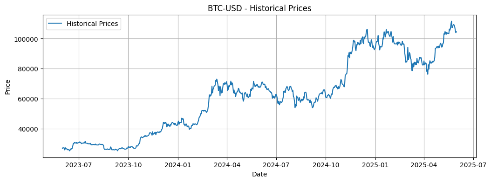
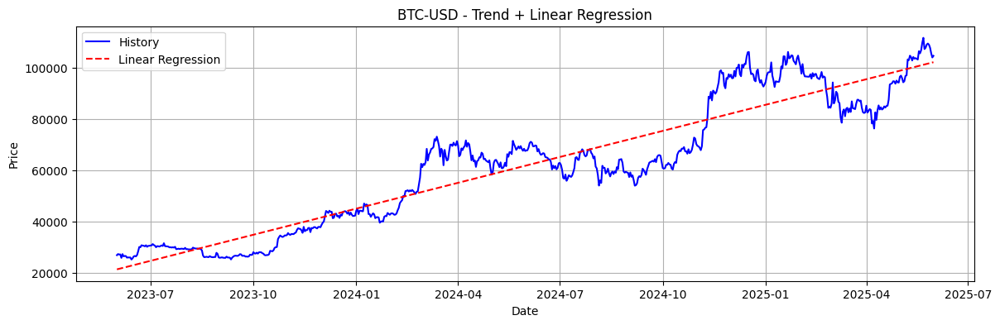
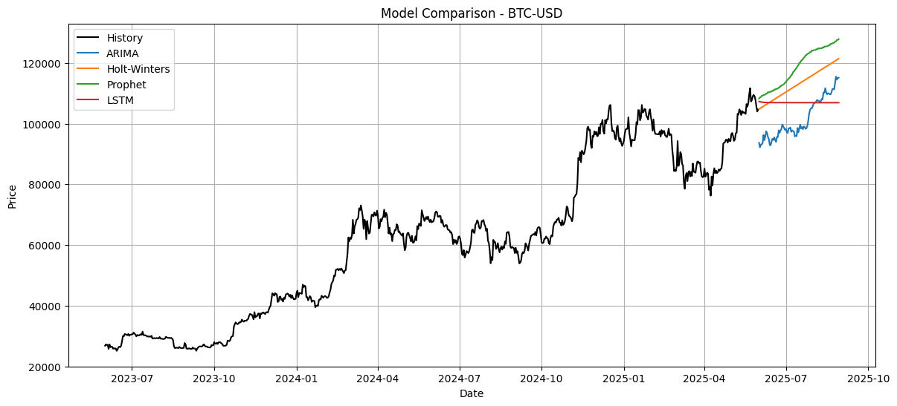
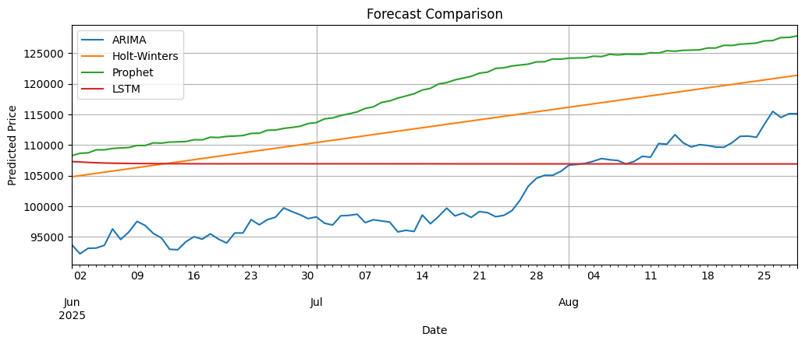

# Cryptocurrency Price Prediction Using Time Series Models

This Google Colab notebook implements and compares four popular time series forecasting models for predicting cryptocurrency prices:

- **ARIMA** – a classic statistical model for stationary series.
- **Holt-Winters (Exponential Smoothing)** – uses trend and seasonality to model recurring patterns.
- **Facebook Prophet** – robust at automatically detecting trends and seasonal components.
- **LSTM (Long Short-Term Memory)** – a deep learning model capable of capturing nonlinear dependencies.

📅 **Forecast Range**: The models predict cryptocurrency prices for the next **90 days** using historical data from **June 1, 2023 to June 1, 2025** retrieved from **Yahoo Finance**.






## 🧩 Features

- Interactive dropdowns for selecting cryptocurrency and fiat currency.
- Visualization of historical price trends.
- Linear regression trendline on historical data.
- Side-by-side forecast comparison of ARIMA, Holt-Winters, Prophet, and LSTM models.
- Fully interactive and runnable in Google Colab.
  
## 📈 Models & Libraries Used

- `yfinance` – for fetching historical crypto price data
- `AutoTS` – for quick implementation of ARIMA
- `Prophet` – time series forecasting library by Meta
- `statsmodels` – for Holt-Winters
- `TensorFlow / Keras` – for the LSTM model
- `matplotlib` – for visualizations
- `ipywidgets` – for user interaction (dropdowns and buttons)

## ⚙️ Installation (Colab Compatible)

The notebook installs all required libraries using `pip`:

```python
!pip install -q yfinance autots matplotlib ipywidgets statsmodels prophet tensorflow

